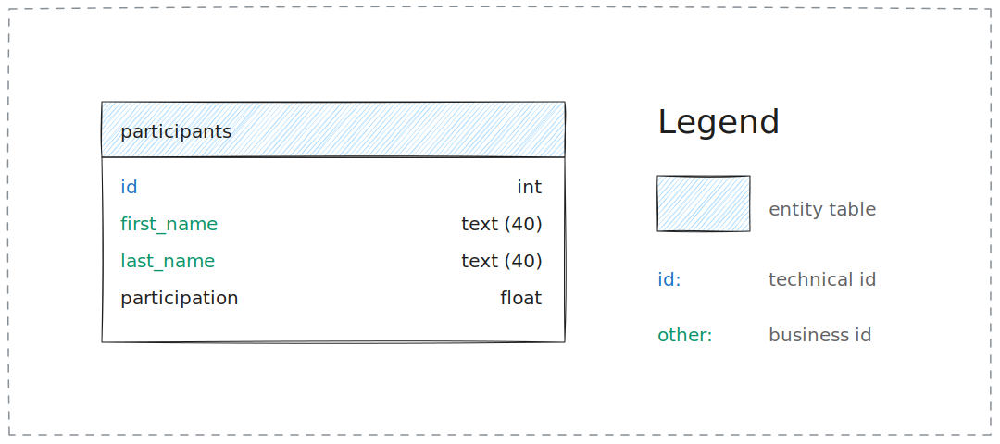
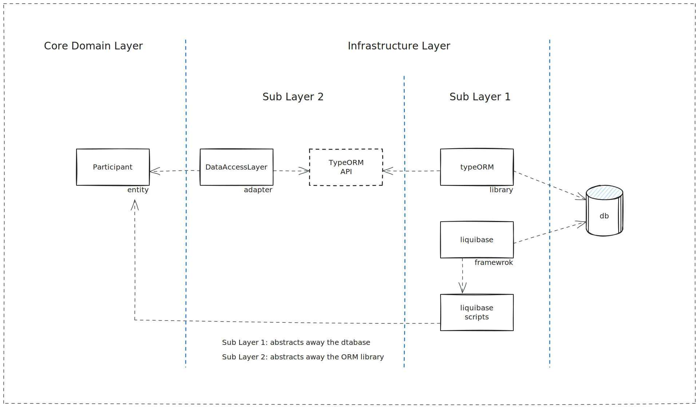

# Cubonetwork challange

[https://github.com/cubonetwork/fullstack-challenge](https://github.com/cubonetwork/fullstack-challenge/blob/master/layout-onepage.png)

## Architecture

### Datamodel

### Data Access Abstraction

The _Data Access Layer_ is divided in two sub layers:

- The _Sub Layer 1_: Makes easyer to switch to another databse. Consists of:
  - [liquibase](https://www.liquibase.org/): Is used to create and migrate the
    structure of the database.
  - [typeORM](https://orkhan.gitbook.io/typeorm/docs): Is used to change the
    content of the database.
- The _Sub Layer 2_: Makes easyer to change ORM framework to another one.

### Starting the database server

#### In a local docker environment

- enter the [database](./database) folder
- start the container with docker compose by executing `docker-compose up --build`

In the [compose.yaml](./database/compose.yaml) for convenience it is included a
[nginx reverse proxy](https://hub.docker.com/_/nginx) and an
[adminer](https://hub.docker.com/_/adminer/) docker container. The _adminer_ is a
database client. The database can be changed and inspected with this tool. The
_nginx_ makes sure that the adminer is reachable from the
[http://localhost/dbadmin](http://localhost/dbadmin) url.

The database is reachable on [localhost:3306](). The database connection info:

- **Server**: database
- **Username**: app
- **Password**: appPwd
- **Database**: cubonetwork

The **liquibase** can be tested by starting the database with the
**docker-compose**. It will run the database creation scripts.
It can be verified by logging in with the adminer.

The [database/typeorm](database/typeorm) folder contains a mini project with a
**jest** test. The test is there to test and also document the usage of the
typeORM library. In order to run the tests the database has to be started with
_docker-compose_ then the test should be executed by running the command:
`npm test`. This test covers a **select**, an **update**, **delete**, **insert**
and a **select max** interaction with the database.
